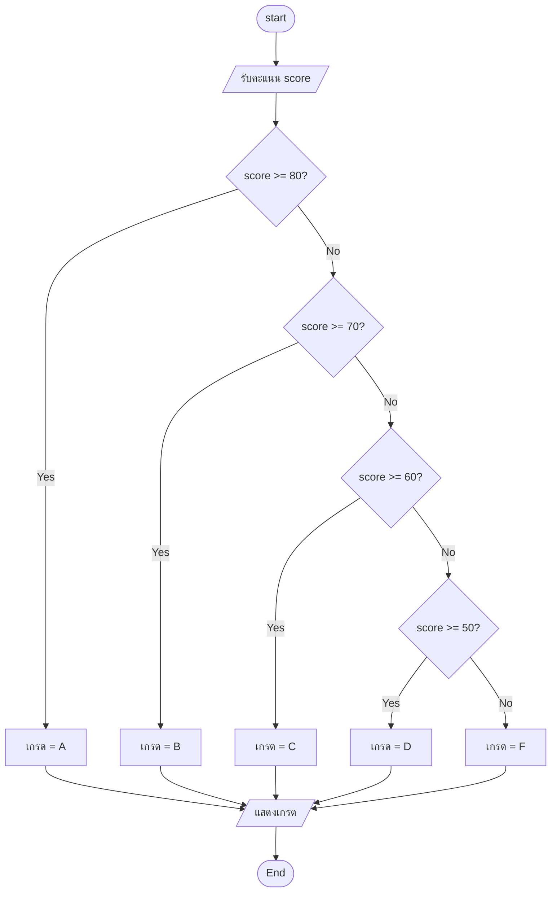
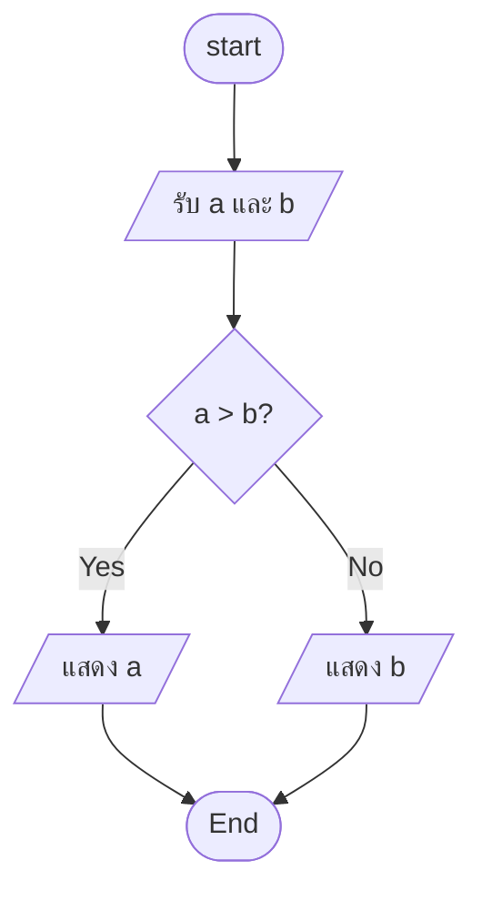
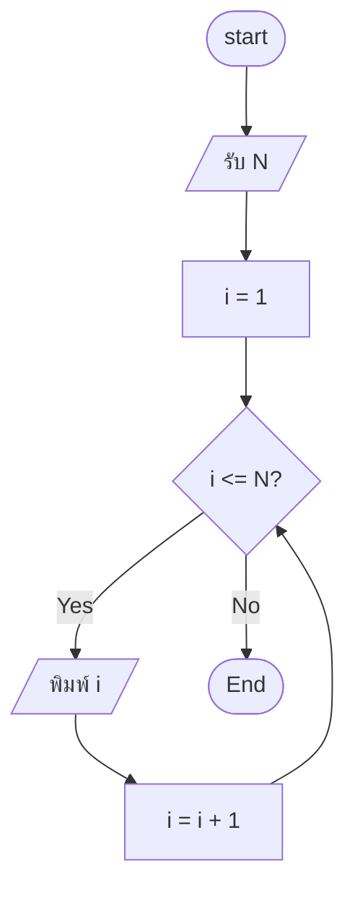

```mermaid

flowchart TD
start([start]) --> input[/รับคะแนน score/]
input --> D1{score >= 80?}
D1 --> |Yes| A[เกรด = A]
D1 --> |No| D2{score >= 70?}
D2 --> |Yes| B[เกรด = B]
D2 --> |No| D3{score >= 60?}
D3 --> |Yes| C[เกรด = C]
D3 --> |No| D4{score >= 50?}
D4 --> |Yes| D[เกรด = D]
D4 --> |No| F[เกรด = F]
A & B & C & D & F --> Output[/แสดงเกรด/]
Output --> End([End])

```

```mermaid
flowchart TD
start([start]) --> input[/รับ a และ b/]
input --> D1{a > b?}
D1 --> |Yes| A[/แสดง a/]
D1 --> |No| B[/แสดง b/]
A & B --> End([End])
```

```mermaid
flowchart TD
start([start]) --> input[/รับ N/]
input --> P1[i = 1]
P1 --> D1{i <= N?}
D1 --> |Yes| A[/พิมพ์ i/]
A --> B[i = i + 1]
B --> D1
D1 --> |No |End([End])

```
