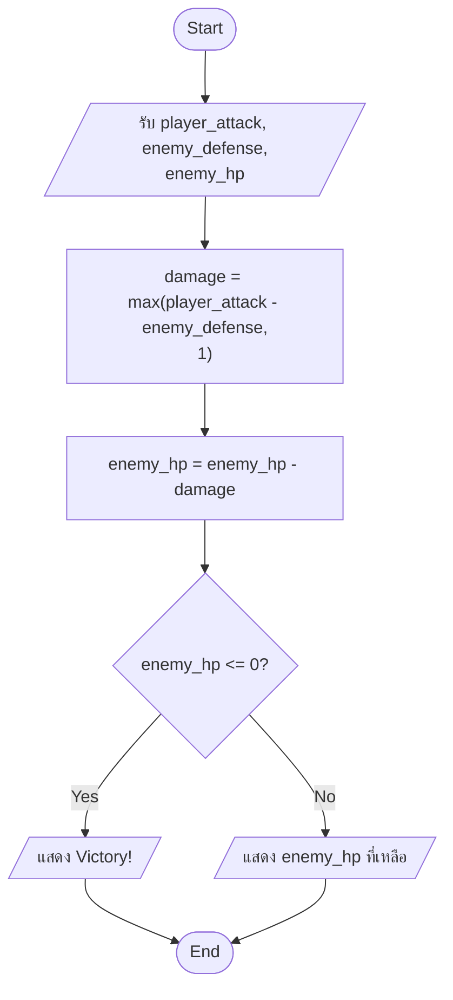
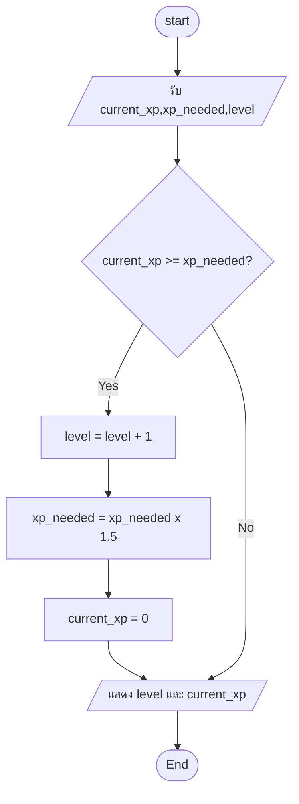
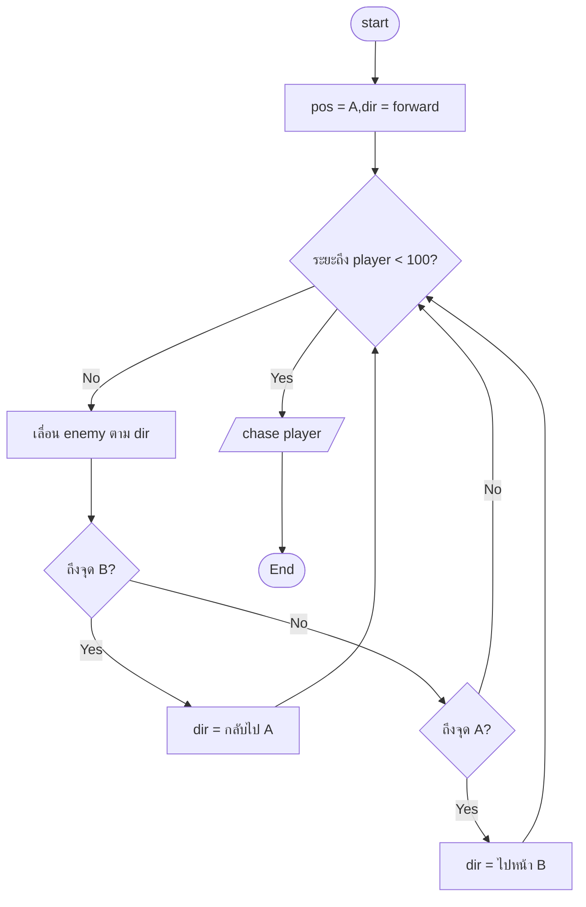

```mermaid
flowchart TD
Start([Start]) --> Input[/รับ player_attack, enemy_defense,
enemy_hp/]
Input --> Calc["damage = max(player_attack - enemy_defense,
1)"]
Calc --> Reduce["enemy_hp = enemy_hp - damage"]
Reduce --> D1{enemy_hp <= 0?}
D1 -->|Yes| Win[/แสดง Victory!/]
D1 -->|No| Show[/แสดง enemy_hp ที่เหลือ/]
Win & Show --> End([End])
```

```mermaid
flowchart TD
start([start]) --> input[/รับ current_xp,xp_needed,level/]
input --> D1{current_xp >= xp_needed?}
D1 --> |Yes| LEV[level = level + 1]
LEV --> XP[xp_needed = xp_needed x 1.5]
XP --> CP[current_xp = 0]
CP --> output[/แสดง level และ current_xp/]
D1 --> |No| output
output --> End([End])
```

```mermaid
flowchart TD
start([start]) --> P[pos = A,dir = forward]
P --> D1{ระยะถึง player < 100?}
D1 --> |Yes| in[/chase player/]
D1 --> |No| P1[เลื่อน enemy ตาม dir]
P1 --> D2{ถึงจุด B?}
D2 --> |Yes| P2[dir = กลับไป A]
P2 --> D1
D2 --> |No| D3{ถึงจุด A?}
D3 --> |Yes| P3[dir = ไปหน้า B]
D3 --> |No| D1
P3 --> D1
in --> End([End])
```
